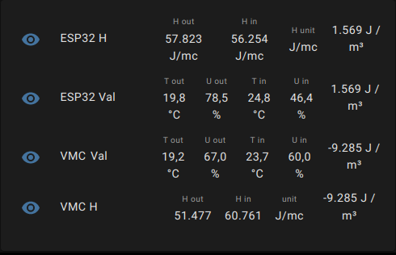

# **Enthalpy calc & diff**

Enthalpy Calculation via minimal webserver [http://0.0.0.0:8080/](http://0.0.0.0:8080/) alis [http://localhost:8080/](http://localhost:8080/) .

Useful to establish e.g. in summer, when change the air with Home Assistant or similar.

Author: vespadj 2021-2022

## Definitions

[https://en.wikipedia.org/wiki/Enthalpy](https://en.wikipedia.org/wiki/Enthalpy)

## Description

Run a Python3 server with `enthalpy_server.py`.

On GET request, return json "a", "b" and "diff" as difference of enthaply (a-b) per volume unit (J/mc) (J/m^3).

Usage example between outdoor and indoor air:

```url
http://0.0.0.0:8080/28 30 0 25 80 0
```

returns:

```json
{"a": 53593, "b": 76176, "diff": -22583, "unit": "J/mc"}
```

Look at `enthalpy_core.py` for parameters description and unit of measure.

The `enthalpy_server.py` calls `enthalpy_core.py` for Python2 and it requires the **CoolProp** library for calculation, by:

[http://www.coolprop.org/fluid_properties/HumidAir.html#haprops-sample](http://www.coolprop.org/fluid_properties/HumidAir.html#haprops-sample)

(Authors: Ian H. Bell and the CoolProp Team)

## Notes

Tested on Raspberry Pi.

CoolProp on Raspberry Pi, actually, works fine with Python2 but not with Pytohn3.

It should be considered that the results can vary greatly with a small variation in temperature and humidity, therefore with the accuracy of the temperature and humidity sensors, normally available on the market, experiments, calibrations must be carried out and the uncertainty of the measurement must not be forgotten.

For example, with two sensors +/- 1 ° C and +/- 5% relative humidity, the same room can have reading values with differences of 2 ° C and 10% hum. which may be result in an enthalpy difference of 10000 J / mc.

## Requirements

- Python3
- Python2
- `pip install CoolProp`

## Integration in Home Assistant

Look at [configuration_sample.yaml](./configutation_sample.yaml), for core configuration.

Example:



realised with the HACS component

`custom:multiple-entity-row` ([link](https://github.com/benct/lovelace-multiple-entity-row)).
